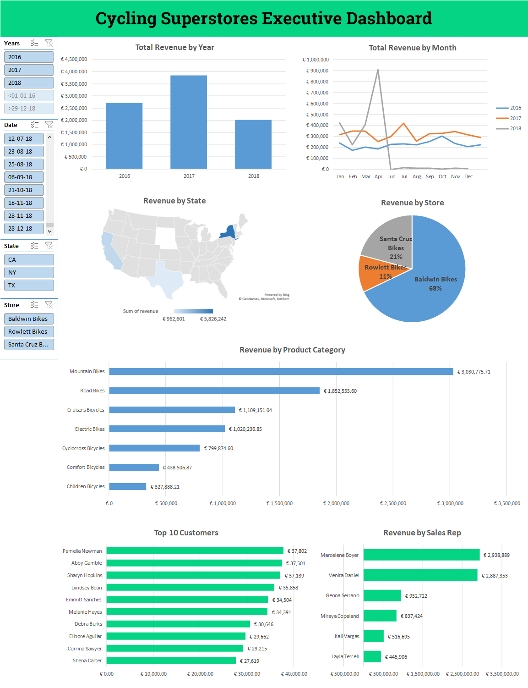
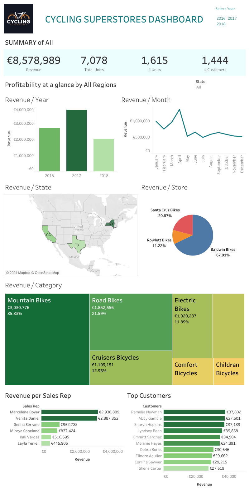

# Cycling Superstores Business Data Analysis

Bike retail company lacks a centralized platform to gain insights into its sales performance, customer behavior, and product trends. Let's explore this problem in the perspective of a business data analyst.

This way we can gain insights into the company's sales performance, customer behavior, and product trends. The company lacked a centralized platform to analyze and visualize its data, making it challenging to identify areas for improvement and growth opportunities.

## Project Overview

**Project Title:** Building an Interactive Sales Dashboard for Data-driven Decision-Making at Cycling Superstores

**Problem Statement:** Cycling Superstores lacked a centralized and user-friendly platform to analyze sales data. This made it difficult for executives to gain insights into sales performance across various metrics like product category, brand, store location, and customer demographics.

## Data Sources:

**Relational Database:** The project utilized data from Cycling Superstores' internal relational database containing sales transactions, customer information, product details, and store locations.

The primary data source for this analysis was the company's transactional data, which included information about sales orders, products, customers, and store locations. Additionally, we utilized publicly available data sources to enrich the analysis with demographic and market trend information.

## Methodology

The project involved the following steps:

* **Data Acquisition:** SQL queries were written to extract relevant data from the relational database, including order details, customer information, product categories, brands, store locations, and sales rep IDs.
* **Data Cleaning:** The extracted data was reviewed and cleaned in Excel to address any missing values, inconsistencies, or redundancies.
* **Data Analysis:** Pivot tables and charts were used in Excel to analyze sales trends by year, month, state, store, brand, product category, customer, and sales rep.
* **Data Visualization:**
  * Excel: Charts like line charts, pie charts, and bar charts were created to present key sales insights in Excel.
  * Tableau: Interactive visualizations like line charts, map charts, pie charts, tree maps, and bar charts were developed in Tableau for a more dynamic and informative dashboard.
* **Dashboard Creation:**
  * Excel: A basic sales dashboard was built in Excel, combining various charts with slicers to allow for interactive filtering by year, state, and store name.
  * Tableau: An interactive dashboard was created in Tableau, enabling executives to explore sales data by year, state, store, brand, product category, customer, and sales rep. Action filters were implemented to ensure all charts update dynamically based on user selections.

## Data Preparation and Exploration

Before diving into the analysis, we performed data cleaning and preprocessing tasks to ensure the data was consistent and ready for analysis. This involved handling missing values, removing duplicates, and transforming data into a suitable format.

During the exploratory data analysis phase, we examined the data from various angles, including:

* Sales trends over time
* Top-selling products and categories
* Customer segmentation and behavior patterns
* Regional performance and market potential

### Data Visualization and Reporting

To effectively communicate the findings and insights, we created interactive dashboards and reports using Excel and Tableau. These visualizations allowed stakeholders to explore the data dynamically and gain a comprehensive understanding of the business performance.

### Excel Dashboard

Here's a snapshot of the Excel dashboard showcasing key metrics and visualizations:

### Tableau Public

We also embedded an [interactive Tableau Public](https://public.tableau.com/views/CyclingSuperstoresExecutiveDashboard/CyclingSuperstoresDashboard?:language=en-GB&:sid=&:display_count=n&:origin=viz_share_link) visualization for a more immersive experience:

## Results and Insights

The project resulted in several key insights:

* Seasonal trends were identified in sales data, highlighting peak sales periods.
* Revenue breakdown by state, store, brand, and product category revealed valuable information for targeted marketing campaigns and inventory management.
* Top-performing customers and sales reps were identified, allowing for recognition and reward programs to boost customer loyalty and sales motivation.

Overall, the interactive sales dashboards empowered executives at Cycling Superstores to make data-driven decisions regarding product offerings, marketing strategies, inventory allocation, and sales team performance.

### Key Findings and Recommendations

Through the analysis, we uncovered several valuable insights and opportunities for Cycling Superstores:

* Product Mix Optimization: Certain product categories and brands were consistently outperforming others. By focusing on these high-performing products and optimizing the product mix, the company could potentially increase sales and profitability.

* Customer Segmentation and Targeted Marketing: By segmenting customers based on their purchasing behavior and demographics, the company could develop targeted marketing campaigns and promotions to better cater to their needs and preferences.

* Regional Expansion: The analysis revealed untapped market potential in specific regions. By expanding its presence in these areas or adjusting its marketing strategies, the company could capture new customer segments and drive growth.

* Supply Chain Optimization: Identifying bottlenecks and inefficiencies in the supply chain could lead to cost savings and improved customer satisfaction through better inventory management and faster order fulfillment.

* [HAQQ](https://haqq.network) Web3 Integration: Leveraging a first-mover advantage, Cycling Superstores will integrate Haqq Network's Web3 technology to offer a revolutionary Peace-of-Mind Ownership (PMO) system. This can be crucial feature to differentiate from other cycling retail businesses.

For a more detailed discussion of the findings, recommendations, and the analysis process, please read the full blog post on [Hashnode blog](https://pizofreude.hashnode.dev/executive-dashboard-for-cycling-superstores).

## Future Work

While this analysis provided valuable insights, there are several areas for further exploration and improvement:

* Incorporating external data sources, such as weather patterns, economic indicators, and competitor data, to gain a more comprehensive understanding of the market dynamics.
* Developing predictive models to forecast demand and optimize inventory levels.
* Implementing advanced analytics techniques, such as customer lifetime value analysis and market basket analysis, to drive more targeted marketing and cross-selling strategies.
* Iterative improvement from the HAQQ Web3 integration based on customer surveys.

## Conclusion

This project showcased the power of business data analysis in uncovering valuable insights and driving business decisions. By leveraging data visualization tools and adopting a data-driven approach, Cycling Superstores can gain a competitive edge, optimize its operations, and enhance customer satisfaction.
